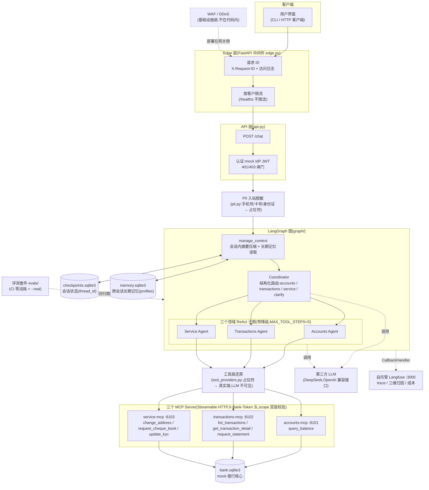

# 系统架构图(与代码一致)

本图按 `src/bank_agent/` 的实际实现绘制,替代英文设计原型 `design-graph.png`。
与原型的差异见文末对照说明。

## 与 `design-graph.png`(英文设计原型)的差异

原型是动工前的设计稿,实现后有以下出入:

| 原型中的元素 | 实际实现 |
| --- | --- |
| Edge 层含 WAF / DDoS / API Gateway | 代码内只有请求 ID、访问日志、按客户限流;WAF/DDoS 明确放在基础设施层(E9 论点) |
| Authentication = Bank's identity provider | mock IdP 自签 HS256 JWT;接真系统时换 OIDC/JWKS(`docs/go-live.md`) |
| Authorisation 挂在 Coordinator 旁 | 授权在 API 层(401/403)+ MCP 工具层 scope 校验;token 走 config 通道,不进 prompt |
| Observability 含 CPU / Memory / Disk | 无系统指标;只有 Langfuse trace(prompt、Agent 调用、工具调用、耗时) |
| 独立 Cost Tracker 组件 | 不建计数器;成本由 Langfuse 价格表在展示层查表得出 |
| Self Hosted LLM + Third-party LLM | 只用第三方 LLM(DeepSeek) |
| Session Store(单一) | 拆成两个:checkpointer(会话状态)+ store(跨会话长期记忆) |
| 无记忆与评测框 | 实际有会话内摘要压缩、长期记忆、PII 三道边界、评测套件 |
