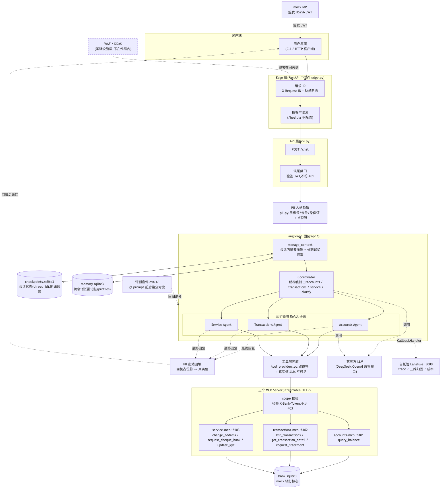

# E0 客户需求开场:一家银行想上 AI 客服

> 对应 git tag:`e0`(项目立项,尚无可运行代码)
> 本集痛点:客户不想打客服电话,银行付不起人工坐席。
> 上一集:无(系列开篇)| 下一集:E1 单 Agent 挂满工具的失败

## 开场话术

(镜头直接对人,不亮代码)

先讲一个你我都经历过的事:打银行客服电话,听三分钟语音导航,排队五分钟,最后为了查一笔 58 块的消费记录。
银行那头也不好受:一个坐席一分钟只能服务一个电话,人力成本压着,客户满意度还往下掉。
所以"AI 客服"这个需求几乎所有银行都提过——但提需求的人和接需求的人之间,隔着一个巨大的坑。
这个坑就是:演示视频里跑通的 AI 客服,和敢放进银行生产环境的 AI 客服,完全是两个物种。
银行要的不是"能聊",而是:客户只能动自己的钱、手机号不能泄露给第三方模型、系统出错要有据可查、改一行提示词要有回归保障。
这个系列十集,我们就从一个真实口吻的客户需求出发,把一套**工业级**的银行多智能体客服系统从零建出来。
今天这一集不写代码,先把需求摊开,把设计图过一遍,顺便说清楚:这张图里有些格子,我们一行代码都不会写——这不是偷懒,是架构边界。


图注:自上而下是请求的一生,客户端穿过 Edge 与 API 进入 LangGraph 图,再到三个领域子图、MCP Server 与银行核心,横向挂着记忆、PII、观测与评测;这张图就是十集的总目录。

## 概念要点

- **需求清单**:六大业务——查余额、查交易明细、申请结单、改地址、申请支票簿、更新 KYC;外加连续办理、含糊澄清、断线续聊、跨会话偏好、PII 保护、越权隔离、故障降级。
  对应 PRD(本仓库 GitHub Issue #1)的用户故事 1–14。
- **设计原型**:`docs/teaching/assets/diagrams/e0-blueprint.png`(中文蓝图,与代码实现逐层一致,开场走读用这张)。
  自上而下:客户端 → Edge 层(WAF/DDoS 在基础设施层,中间件管请求 ID 与限流)→ API 层认证闸门 → Coordinator Agent → Accounts/Transactions/Service 三个领域 Agent → 各自的 MCP Server → mock 银行核心;横向挂着 PII 脱敏、会话与长期记忆、可观测、评测套件。
  仓库里另存一份英文原始设计稿 `docs/design-graph.png`,是立项时的草图,分层一致,留作对照。
- **一句话架构**:Coordinator 只做分派,三个领域子图各管一摊,工具经 MCP 协议远程调用,下游是 mock 银行核心——但 mock 按"可替换"的形状设计,最后一集会说清接真系统时换哪几个模块。
- **有些能力不在代码里**:设计图上的 WAF、DDoS 防护属于基础设施层(云厂商/网关),应用代码假装实现它们反而是安全隐患。
  这个边界本系列会反复强调,收官集(E9)专门讲透。
- **技术选型一句话版**(已锁定,不展开):Python 3.12 + LangGraph 手写 StateGraph(不用 supervisor 封装库)+ DeepSeek(OpenAI 兼容接口)+ FastMCP(Streamable HTTP)+ SQLModel/SQLite + 自托管 Langfuse。
- **演示数据**:客户 C001 张三、C002 李四,账户 A001/A002/A101,交易 T001–T005,种子脚本 `src/bank_agent/core/seed.py`。

## 演示步骤

1. 展示仓库首页与 `docs/teaching/assets/diagrams/e0-blueprint.png`,按上一条要点的顺序走读一遍。
   (镜头:在图上逐层指;讲到 WAF/DDoS 时停顿——"这两个格子,我们一行代码都不会写,为什么,放到最后一集")
   英文原始设计稿 `docs/design-graph.png` 提一句即可:内容等价,本系列走读统一用这张与实现一致的中文蓝图。
2. 过一遍需求清单,强调哪些是"演示级"需求(能聊),哪些是"工业级"需求(授权、PII、可观测、评测)。
   (话术提示:让观众自己判断手里的 demo 缺哪几项)
3. 学员环境准备(此时尚无代码,以下命令在 main 上执行,供提前备机):
   ```bash
   git clone <repo> && cd bank-agent-learn
   make setup
   cp .env.example .env   # 填入 LLM_API_KEY(DeepSeek 等 OpenAI 兼容接口)
   ```
4. 展示本教案目录 docs/teaching/README.md 的分集地图与 tag 对照表,说明"每集一个 git tag,可以从中间任意点切入"。

## 收尾钩子

今天我们只干了一件事:把"银行要的到底是什么"说清楚,把设计图上的每个格子归了类——哪些我们写,哪些基础设施给。
下一集我们写第一版,而且故意用最直觉、最 naive 的写法:一个 Agent,挂满全部工具。
我会让它在现场翻车给你看——因为只有亲眼看到它怎么死,后面的每一步架构决策你才不需要我解释"为什么"。
