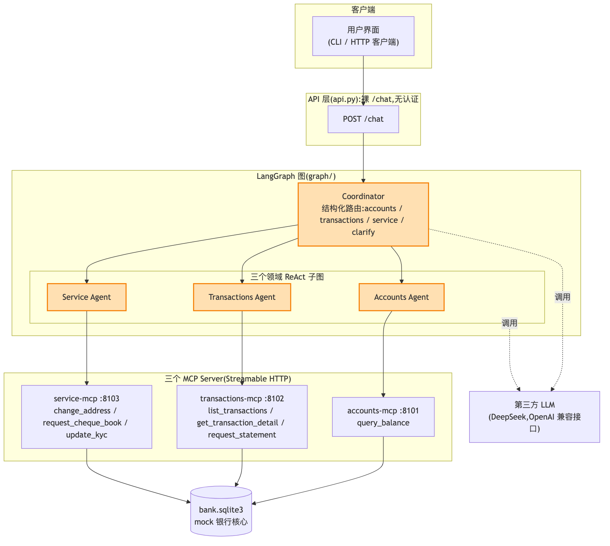

# E2 垂直拆分多智能体

> 对应 git tag:`e2`(Coordinator + 三领域子图 + 三个 MCP Server + mock 银行核心;尚无认证)
> 本集痛点:一个 Agent 什么都管必然翻车,拆成"调度员 + 领域专员",并正面回答"调度员判断错了怎么办"。
> 上一集:E1 单 Agent 挂满工具的失败 | 下一集:E3 认证与授权

## 开场话术

上一集结尾我们留了一张翻车清单:选错工具、漏办半件事、工具说明把上下文吃爆,以及最要命的——LLM 能替客户自称任何人。
今天先解决前三条,最后一条留给下一集,因为它不是"拆"能解决的。
直觉所有人都一样:拆。
但请注意,真实银行从来就不是一个柜员办所有业务。
你走进网点,先遇到的是大堂经理,他不碰你的钱,只做一件事——问清你要办什么,然后把你领到对的柜台。
柜台后面的人才是专家:管账户的只管账户,管交易的只管交易,每人手边只放自己那摊业务的印章和表格。
为什么银行要这么组织?
不是因为柜员笨,是因为任何一个人都不可能同时对几十个业务保持专精,更不可能在出错时把责任边界划清楚。
软件里这叫关注点分离,银行里这叫内控,本质是同一件事。
今天我们把这套"大堂经理加专柜"的组织方式原样搬进代码:一个叫 Coordinator 的调度员,加三个领域专员子图,各自只带自己领域的工具。
但上一集我预告过一个尖锐的问题:这个调度员本身也是 LLM,它判断错了怎么办?
今天正面回答,而且答案不是一个技巧,是一整套组合拳:让它只输出结构化 JSON、解析失败就降级反问、"没听懂"本身是一个合法的调度结果。
这套组合拳是本集的灵魂,演示的时候我们会故意把它一招一招都打出来给你看。
还有一件事要特别声明:本集我们不用任何现成封装库,图是自己手写 StateGraph 装配的。
不是封装库不好,而是教学目标要求机制透明——调度员怎么跳、状态怎么流、循环怎么熔断,每一行都得能看见。
等你把这些机制看透了,再去用封装库,你才知道它替你挡了什么、又悄悄替你决定了什么。
这一集跑完,系统就"能聊"了——六个业务全部走通,含糊请求会反问,子系统挂了有降级话术。
看完你会明白,工业级多智能体和玩具 demo 的差别,不在模型,全在今天这些"不好看"的工程细节里。


图注:对照上一集那张图读,胖 Agent 被拆成只输出结构化 JSON 的 Coordinator 加三个领域子图,工具按域切给三个独立 MCP Server;注意这张图里还没有认证闸门。

## 概念要点

开讲前先给观众一张地图:本集代码分四层——调度与路由、领域子图、MCP 工具服务、mock 银行核心。
下面六个概念,正好覆盖这四层加上两条横切的工程原则。

- **Coordinator 只做分派不办业务**:调度员的 LLM 输出一段结构化 JSON,代码解析后用 `Command(goto=...)` 一跳到目标领域子图;解析失败不硬猜,直接降级成反问(代码位置 `src/bank_agent/graph/coordinator.py`)。
- **路由决策是结构化数据,不是自由文本**:目标只有四个取值 `accounts / transactions / service / clarify`,外加判断理由和反问句;LLM 的输出按"不可信"处理——剥代码围栏、提取第一个完整 JSON 对象、pydantic 校验,任何一步失败都抛错(代码位置 `src/bank_agent/routing.py`,路由目标定义在 `src/bank_agent/state.py`)。
- **clarify 是一等路由目标**:意图不明时,"反问客户"和"转交专员"地位平等,直接结束本轮并兜底一句固定反问,不进任何子图、不瞎猜(代码位置 `src/bank_agent/prompts.py` 的 `CLARIFY_FALLBACK`)。
- **三个领域子图各自是完整的 ReAct 循环**:每个专员有独立的 system prompt、独立的工具集,在 agent 与 call_tools 之间来回,最多 5 步工具调用,超限进 give_up 节点返回降级话术;`tool_steps` 是子图私有键,不泄漏到父图状态(代码位置 `src/bank_agent/graph/subgraphs.py`)。
- **一跳往返由图结构保证,不靠自觉**:整张图是 coordinator 指向三个领域节点、领域节点全部指向 END,没有任何回边;万一失控,调图处还有 `recursion_limit = 25` 兜底,超限照样返回降级话术(代码位置 `src/bank_agent/graph/builder.py` 与 `src/bank_agent/chat.py`)。
- **工具层按领域物理隔离,业务真相在数据库**:三个 FastMCP Server 各自独立进程、独立端口 8101 到 8103;背后是 mock 银行核心,SQLModel 实体加按领域切分的仓储,写操作真实落库;prompt 只写角色与输出约定,业务能力描述全部放在 MCP 工具的 docstring 里(代码位置 `src/bank_agent/mcp_servers/` 与 `src/bank_agent/core/`)。

## 演示步骤

本段所有命令都在 tag e2 下核对过;除起栈外,真实 LLM 调用只出现在 curl 对话环节。
建议两个终端并排:一个跑服务,一个发请求。

1. 检出本集 tag,先看一眼"大堂经理加专柜"的代码布局:
   ```bash
   git checkout e2
   ls src/bank_agent/graph src/bank_agent/mcp_servers src/bank_agent/core
   ```
   预期:graph 目录里是 coordinator、subgraphs、builder 三件;mcp_servers 里是 accounts、transactions、service 三个独立 Server;core 里是模型、仓储和种子数据。
   (镜头:对照上一集的天真脚本——同样七个工具,这里被切成了三份,每份背后一个专员)
2. 起栈(本 tag 没有 Langfuse,拉起的是 3 个 MCP Server 加 API,共 4 个进程):
   ```bash
   make run
   ```
   预期:终端打印"已启动:3 个 MCP Server + API",种子客户张三自动落库。
   (镜头:强调这三个 MCP Server 是三个独立进程、三个独立端口 8101 到 8103——领域之间的隔离是进程级的,不是 import 级别的嘴上隔离)
3. 另开一个终端,直接 curl 打对话接口——注意,本集还没有认证,不带任何 token,`customer_id` 缺省就是张三:
   ```bash
   curl -s http://127.0.0.1:8000/chat -H 'Content-Type: application/json' -d '{"message":"帮我查一下余额"}'
   ```
   预期:返回 JSON 里 `route` 是 `accounts`,reply 报出储蓄账户 12800.50 元与活期 3200.00 元,并带一个 `thread_id`。
   (镜头:指着 `route` 字段——上一集我们永远不知道模型心里想的什么,这一集每一次分派都留下了理由)
   (讲解:回复里的 `thread_id` 记下来,后面续聊要用;这是会话的身份证,第 6 步靠它)
4. 六个业务各来一句,逐题观察 `route` 字段:
   ```bash
   curl -s http://127.0.0.1:8000/chat -H 'Content-Type: application/json' -d '{"message":"看看我 A001 账户最近的交易"}'
   curl -s http://127.0.0.1:8000/chat -H 'Content-Type: application/json' -d '{"message":"帮我申请 A001 今年 8 月的结单"}'
   curl -s http://127.0.0.1:8000/chat -H 'Content-Type: application/json' -d '{"message":"把我的地址改成上海市浦东新区世纪大道 100 号"}'
   curl -s http://127.0.0.1:8000/chat -H 'Content-Type: application/json' -d '{"message":"给 A002 申请一个支票簿"}'
   curl -s http://127.0.0.1:8000/chat -H 'Content-Type: application/json' -d '{"message":"把我的手机号更新为 13911112222"}'
   ```
   预期:查明细和开结单走 `transactions`,改地址、支票簿、更新手机号走 `service`;改地址、改手机号这类写操作是真实落库的,不是嘴上说"已办理"。
   (镜头:可以改完地址立刻再问一句"我现在地址是什么",让数据自己说话)
   (讲解:注意每个专员手里只有本领域的两三个工具——上一集"七个工具一起塞"导致的选错与漏办,在结构上就不太可能发生了)
5. 上一集最尴尬的场面,今天主动演一遍——发一句谁都听不懂的话:
   ```bash
   curl -s http://127.0.0.1:8000/chat -H 'Content-Type: application/json' -d '{"message":"那个事办得怎么样了"}'
   ```
   预期:`route` 是 `clarify`,reply 是一句反问,不进任何子图、不瞎猜着办。
   (讲解:这就是"调度员判断不了"的合法出口——反问不是失败,是设计出来的路由目标)
   (讲解:还有一层观众看不见的兜底——如果调度员连 JSON 都输出错了,代码会把这轮也降级成反问;测试 `test_unparseable_route_output_falls_back_to_clarify` 钉死了这个行为)
6. 同一轮对话里换话题,看调度员重新分派;用上一步返回的 `thread_id` 续聊:
   ```bash
   curl -s http://127.0.0.1:8000/chat -H 'Content-Type: application/json' -d '{"message":"帮我查一下余额"}'
   curl -s http://127.0.0.1:8000/chat -H 'Content-Type: application/json' -d '{"message":"那笔 15000 的工资是哪天到的","thread_id":"<上一步返回的 thread_id>"}'
   ```
   预期:第一句走 `accounts`,第二句带着会话上下文被重新路由到 `transactions`——每一轮客户开口,调度员都重新判断一次,不是一锤子买卖。
   (讲解:真实客户就是这样说话的,先查余额,顺着余额问明细;Coordinator 每轮重路由,刚好匹配这种唠家常式的业务流)
7. 降级话术不用等系统真挂,测试里已经写死了两个事故剧本,直接打开看:
   ```bash
   git show e2:tests/test_e2e_api.py
   ```
   预期:找到 `test_tool_loop_stops_at_max_steps`(专员连续要调 6 次工具,第 5 步上限触发 give_up,返回"系统暂时繁忙"的降级话术)和 `test_subgraph_failure_returns_degraded_message`(MCP 层整体故障,父图捕获异常同样返回降级话术)。
   (镜头:指着这两个用例说——"好用的系统千篇一律,扛事的系统都在这里")
   (讲解:顺手指出 `test_all_six_businesses_in_one_thread`——同一会话连续办五轮业务不被步数熔断误杀,说明兜底阈值是调过的,不是拍脑袋写的)
8. 全量测试收尾,零 LLM 消耗:
   ```bash
   make test
   ```
   预期:23 个测试全绿,覆盖六业务连办、clarify 反问、路由解析失败兜底、子图异常降级、工具死循环截停。
   (讲解:测试用预录脚本的假模型驱动,不花一分钱 API 额度——"能聊"是演示,"能测"才是工程)
9. 演示结束回到主线:
   ```bash
   git checkout main
   ```

## 收尾钩子

今天我们把一个什么都管的大 Agent,拆成了一个大堂经理加三个专柜。
调度员只输出结构化路由,解析不了就反问,反问本身就是合法目标。
专员各自带着自己领域的两三个工具,在子图里跑完整循环;跑疯了 5 步熔断,子系统挂了降级话术,父图还有 25 步的总闸兜底。
上一集翻车清单里的"选错工具、漏办、上下文膨胀",到这里每条都有了对应的工程机关,而且每一道机关都有测试钉着。
这就是垂直拆分的全部要义:职责收窄,工具收窄,出错的爆炸半径跟着收窄。

但请你回想演示的第 3 步——我们 curl 的时候,什么凭证都没带,接口就默认你是张三。
更过分的是,请求体里其实可以自己填 `customer_id`,填 C002,系统就把你当李四接待。
也就是说,这套系统现在对"你是谁"这件事,完全是听客户自己报号。
上一集那个最要命的翻车——LLM 能替客户自称任何人——今天原封不动地还在。
拆完只是"能聊",离"敢用"还差最关键的一块:客户的身份到底由谁保证?
token 从 HTTP 层到工具层这一路,怎么走才能既到得了工具、又不让 LLM 碰到?
下一集,认证与授权,我们把今天故意留的这个窟窿补上。
