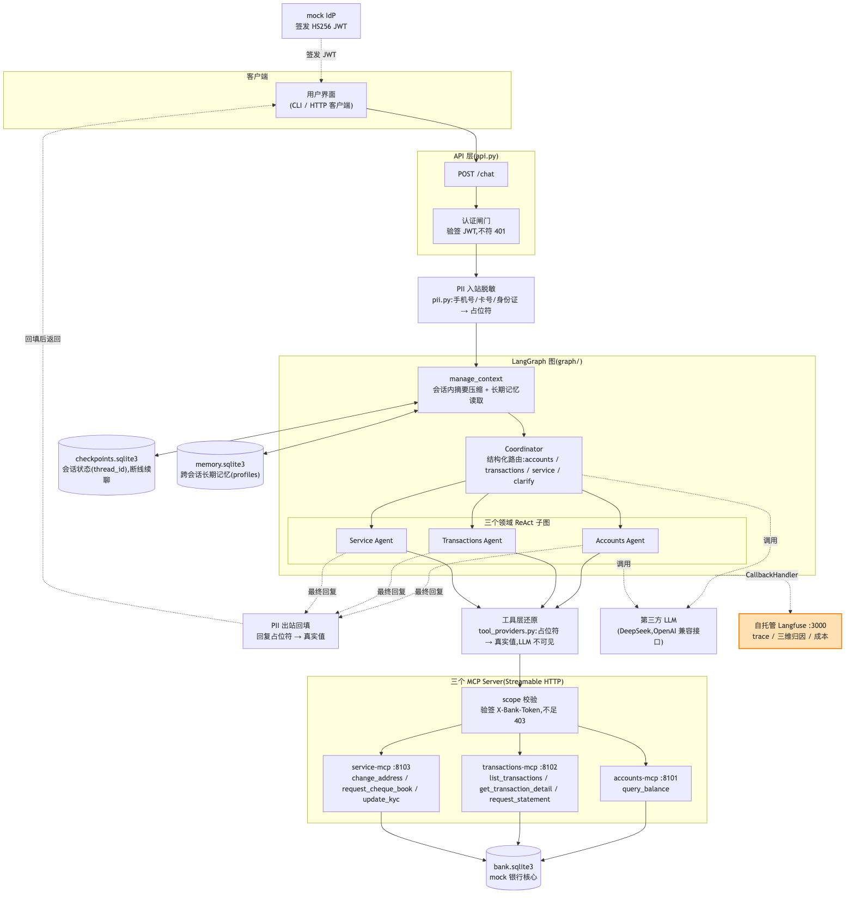
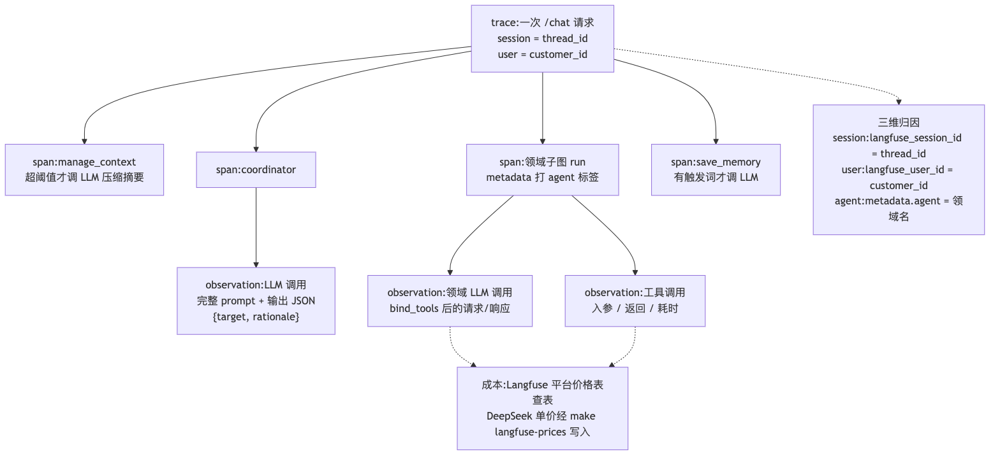
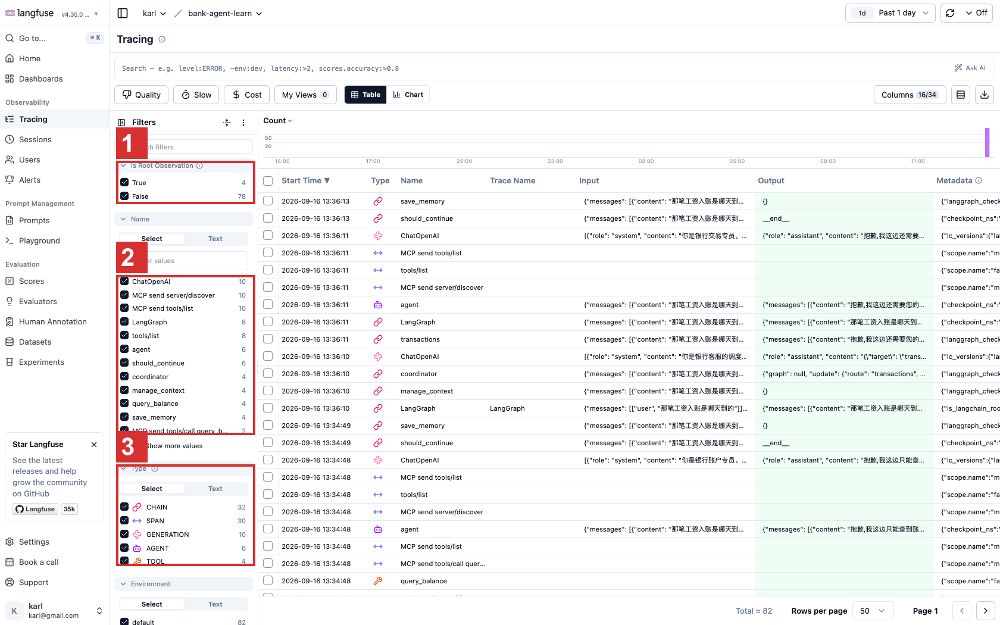
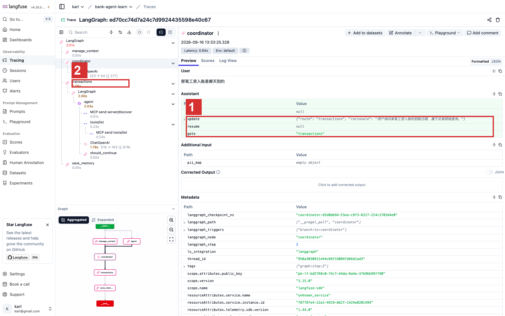
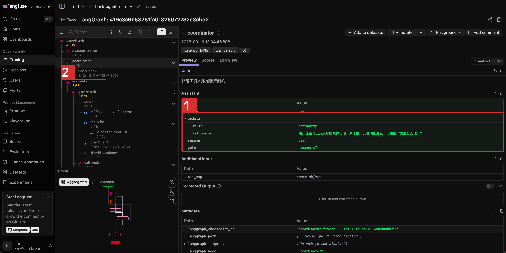
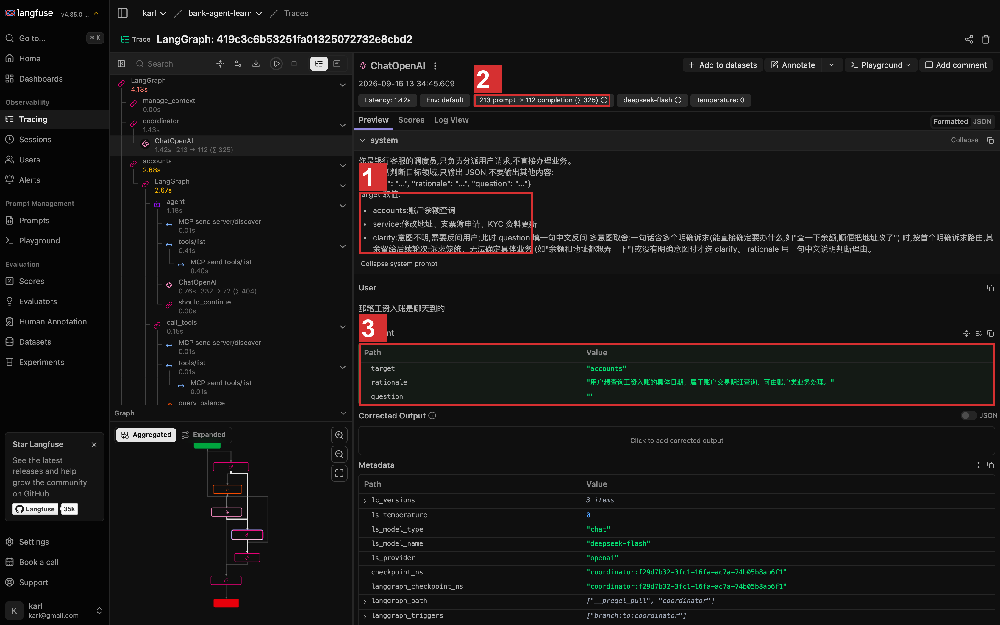
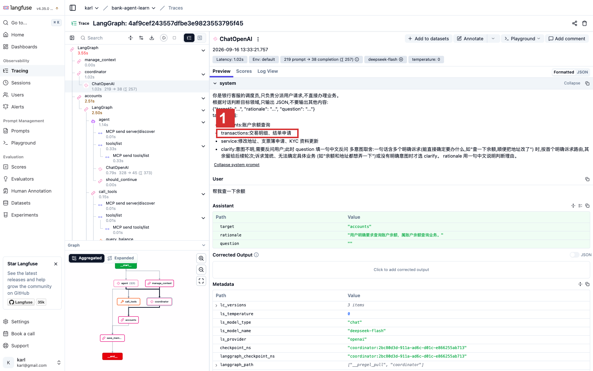
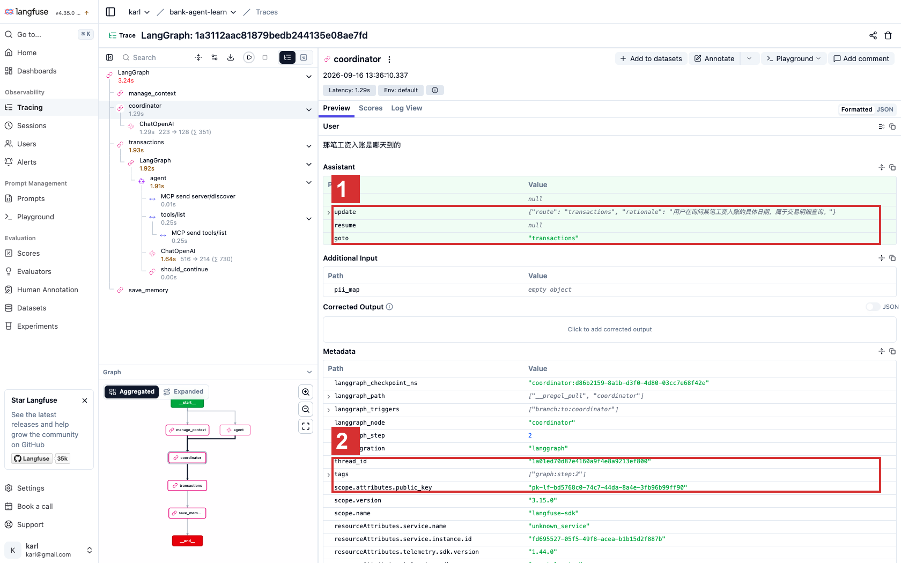

# E7 可观测性与成本:trace 里现场抓一次路由错误

> 对应 git tag:`e7`(自托管 Langfuse 全栈 + trace 三维归因 + 价格表初始化;与 e8 同 commit,评测留给下一集)
> 本集痛点:LLM 系统"回答得不对"没有堆栈可查,模型费用只有一张总额账单。
> 上一集:E6 PII 脱敏 | 下一集:E8 评测套件

## 开场话术

传统后端服务出了问题,我们有一套成熟的求生流程。
看日志、看堆栈、顺着调用链找到那一行代码,修掉,回归测试,收工。
这套流程能成立,是因为传统系统的错误有形状:它会在某个确定的位置爆炸,留下一具可以解剖的尸体。

LLM 系统完全不一样。
客户投诉"你们的 AI 答非所问",你打开日志,发现系统根本没报错。
每一步都正常返回,HTTP 200,栈是干净的,进程是健康的。
唯一的问题是:调度员把"查工资入账"分派给了查余额的专员。
没有异常,没有堆栈,错误藏在一个模型某一次输出的 JSON 里,而那次输出你压根没存下来。
尸体被冲进下水道了,你手里只有一句客户的口头描述。

再换一个场景,这次不是技术问题,是财务问题。
月底老板问:上个月模型费用花在哪了?
哪个客户最能聊?哪个功能烧得最多?改地址和查结单哪个更贵?
你打开云厂商控制台,只有一张总额账单,一个孤零零的数字,连个备注都没有。
想拆细?自己埋点、自己数 token、自己维护一张价格表——一套小工程,排期三个月起步,而且还没算维护成本。

这两种无力感指向同一个缺失:看不见。
传统系统里,可观测性是运维部门的预算项;LLM 系统里,它是这个系统能不能被称为"系统"的分水岭。
一个"差不多能跑"但看不见内部发生了什么的黑盒,没人敢让它上生产。
因为大家都清楚,出事那天你只能对着空气排查,对着总额账单挨骂。

上一集我们把敏感数据挡在了模型外面,这一集我们给系统装上眼睛。
把每一次对话里调度员怎么想的、模型收到什么、工具干了什么、花了多少钱,全部收进一条可以回放的记录里。
然后现场演一遍:故意把路由改坏,再用这双眼睛当场把它抓出来。


图注:运行时架构本身没动,多出来的是右下角的自托管 Langfuse;图内每次 LLM 与工具调用经回调上报成 trace,业务代码一行不改。

## 概念要点

- **trace 是什么**:一次对话从头到尾的完整录像——每个节点、每次 LLM 调用的输入输出、每次工具调用的参数与结果,挂在同一棵树上,随时点开回放(`src/bank_agent/observability.py`)。


图注:一条 trace 就是一次请求的树,span 对应图节点、observation 对应 LLM 与工具调用,底部两条虚线是三维归因与成本查表;排障时从 coordinator 那个节点点开。

- **接入方式:回调而不是埋点**:Langfuse SDK v3 单例加一个 CallbackHandler,经图调用的 config 注入(callbacks 加 metadata),业务代码一行不改(`src/bank_agent/observability.py` 的 `trace_config`,唯一拼装在 `src/bank_agent/chat.py`)。
- **没配 key 就自动隐身**:`configure` 发现 key 缺失时不建客户端,`trace_config` 返回空 dict,图照常运行——测试和离线环境对可观测性零依赖,这不是降级,是设计(`src/bank_agent/observability.py`)。
- **三维归因:会话、用户、Agent**:会话等于 thread_id,用户等于 customer_id,领域 Agent 靠子图调用的 metadata.agent 和各节点名区分(`src/bank_agent/graph/builder.py` 给子图打 agent 标签;`src/bank_agent/graph/coordinator.py` 有注释:config 显式下传,LLM 调用才挂为图内子 run,归因到节点)。
- **自托管 Langfuse 而不是 LangSmith**:LangSmith 是闭源 SaaS,国内访问不稳,数据还要出域;`docker-compose.yml` 一键起 Postgres + ClickHouse + Redis + MinIO + web/worker 全家桶,LANGFUSE_INIT_* 变量自动建好项目与开发 key,和 `.env.example` 预填的 pk-lf-bank-agent-dev / sk-lf-bank-agent-dev 严丝合缝,照抄即用。
- **成本用平台原生价格表,不自建计数器**:Langfuse 默认价格表不含 DeepSeek,首次起栈跑一次 `make langfuse-prices`,经公开 API 幂等写入单价;以后换模型,去 Langfuse UI 的 Models 页补一行价格即可(`src/bank_agent/langfuse_setup.py`)。

## 演示步骤

1. 检出本集 tag 并起栈:
   ```bash
   git checkout e7
   make run
   ```
   预期:种子数据就绪,docker compose 拉起 Langfuse 全栈,随后 3 个 MCP Server 和 API 依次起来。
   无 docker 的机器会自动跳过 Langfuse,系统照常运行——但本集演示需要 docker,请提前确认。
2. 浏览器打开 http://localhost:3000,用 demo@bank-agent.local / bank-agent-demo-password 登录。
   预期:直接看到自动建好的组织和项目,不用点任何初始化向导——compose 里的 LANGFUSE_INIT_* 变量已经代劳。
   (镜头:强调"自托管"三个字——trace 数据不出机房,这在银行不是加分项,是准入条件)
3. 先跑一遍价格表初始化,给后面的成本演示铺路:
   ```bash
   make langfuse-prices
   ```
   预期:当前配置的模型(默认 deepseek-chat)的输入/输出单价写入自托管实例;再跑一遍提示"已存在",幂等不重复创建。
   (讲解:内置价格表只备了 deepseek-chat 与 deepseek-reasoner 两档;配了其他模型时会提示跳过,去 Langfuse UI 的 Models 页手工补一行即可)
   (讲解:只做这一次,后面所有成本数字都来自平台查表,我们的代码里没有一个计数器)
4. 正常聊两句,制造一条健康的 trace。CLI 或 curl 任选:
   ```bash
   make cli
   ```
   或者:
   ```bash
   TOKEN=$(python -m bank_agent.auth.idp C001)
   curl -s http://127.0.0.1:8000/chat -H "Authorization: Bearer $TOKEN" -H 'Content-Type: application/json' -d '{"message":"帮我查一下余额"}'
   curl -s http://127.0.0.1:8000/chat -H "Authorization: Bearer $TOKEN" -H 'Content-Type: application/json' -d '{"message":"最近那笔房租是哪天扣的"}'
   ```
   预期:回答正常,第一句走 accounts,第二句走 transactions,路由都对。
5. 回到 Langfuse 刷新,找到刚才那条 trace 并展开。
   预期:manage_context → coordinator → 领域子图 → 工具调用,一整条链收在同一条 trace 里。
   点开 coordinator 节点,能看到它收到的完整 prompt,以及它输出的那段 JSON——target 加 rationale。
   侧边栏能看到 session 是 thread_id、user 是 C001、领域子图的 observation 带着 agent 标签。
   在 Tracing 列表里,一次对话会被拆成几十条 observation,root 那几条才是整棵树的入口:

   

   图注:① 只看 root 就是 4 次对话;② 每次对话内部是 coordinator、ChatOpenAI、MCP 工具调用等一整串 observation;③ 按类型分 CHAIN/SPAN/GENERATION/TOOL,几次演示对话就攒了 82 条。
   点开一条健康 trace 的 coordinator 节点,长这样:

   

   图注:① 输出 JSON 里 route 是 transactions,rationale 写着判断理由;② 左侧树上工资问题走的是 transactions 子图——调度员的思考过程,一字不差地存下来了。
   (镜头:点开那次 LLM 调用——"这就是调度员的思考过程,一字不差地存下来了")
   再顺手点开一次工具调用的 observation,能看到工具入参和返回的完整 JSON,连耗时都分节点列着。
   一句话总结给观众:以前这些信息散落在 stdout 和记忆里,现在它们有家了。
6. 现在制造故障。
   编辑 `src/bank_agent/prompts.py`,把 COORDINATOR_PROMPT 里 transactions 那一行删掉,或者改成一句误导性的描述,保存。
   (讲解:现实中这对应什么?对应新人改 prompt 时手滑,对应产品经理觉得"调度员不需要知道结单",对应一切看似无害的文案微调)
   注意,我们删的不是代码,是一行自然语言——这就是 LLM 系统的脆弱性:一行中文注释级别的改动,就是一个行为变更。
7. 再问一个明显该走交易领域的问题:
   ```bash
   curl -s http://127.0.0.1:8000/chat -H "Authorization: Bearer $TOKEN" -H 'Content-Type: application/json' -d '{"message":"那笔工资入账是哪天到的"}'
   ```
   预期:回复跑偏——种子数据里 T002 就是那笔一万五的工资入账,本该一句话查出来,现在调度员把它分去了 accounts,或者干脆 clarify 反问一句不着边际的话。
   (讲解:注意看终端和进程,没有任何报错,HTTP 200,一切"健康"——这就是开场说的那种没有堆栈的错误)
8. 回到 Langfuse 刷新,展开这条新 trace 的 coordinator 节点。
   预期:LLM 输入里,prompt 上 transactions 那行果然没有了;原始输出的 rationale 写着它为什么选了别的地方。
   输入是什么、输出是什么、理由是什么,三者并排躺在屏幕上——案发现场完整可回放。

   

   图注:① 同样的工资问题,这次 route 是 accounts,rationale 还振振有词;② 左侧树上执行的确实是 accounts 子图——答非所问就这么发生了,而系统没有任何报错。
   再点开 coordinator 下面的 ChatOpenAI,案发现场全貌:

   

   图注:① target 取值列表里少了 transactions 一行——调度员根本不知道还有这个选项;② 这次调用照样花了 325 个 token;③ 输出理直气壮地选了 accounts。
   对照健康 trace 的同一位置,差别就一行:

   

   图注:① 正常情况下 target 取值里有 transactions 那行——一行之差,路由对错立见。
   (镜头:指着 rationale 那行字——"传统系统里这是堆栈,LLM 系统里这是口供,而口供只活在 trace 里")
9. 定位到是自己刚改的 prompt,改回去,重启服务,再问一遍同样的问题。
   预期:路由恢复,新 trace 的 coordinator 输出 target 又是 transactions,回答里出现了正确的入账日期。

   

   图注:① route 回到 transactions,rationale 也对了;② metadata 里的 thread_id 与 tags,就是按会话归因落地的样子。
10. 顺手验证上一集埋下的伏笔:制造一条含手机号的对话(比如"我的手机号是 13800001111,帮我改一下地址"),然后在 trace 里看 LLM 的实际输入。
    预期:模型看到的只有 [PHONE_1] 占位符——脱敏发生在进图之前,trace 录下来的本来就是脱敏后的世界,观测系统和安全边界互不打架。
    (讲解:这也是选对方案的暗线——如果 trace 平台是境外的 SaaS,就算录的是占位符,合规上也说不清楚)
11. 成本演示:在 Langfuse UI 里分别按 model、按 session、按 metadata.agent 过滤,看 token 用量和成本金额。
    预期:每个维度都能拆出花费——哪个客户话多、哪个领域 Agent 烧 token、哪条会话最贵,一目了然,可以当场回答老板的问题。
12. 为了讲透"不自建计数器",做个对照实验:先在 Models 页删掉模型定义,再聊一句,看新 trace 的成本列是空白;然后跑一次 `make langfuse-prices` 补回单价,再聊一句,成本回来了。
    预期:同一类调用,有价格表就有成本,没有就是空白——成本是平台在展示层的查表动作,不是我们在代码里按计算器。
13. 演示结束,回到主线:
    ```bash
    git checkout main
    ```
    预期:工作区干净,prompts.py 的临时改动已随改回步骤复原——如果刚才忘了改回,checkout 前记得先恢复。

## 收尾钩子

今天系统长出了眼睛。
一次对话里每个节点干了什么、模型收到什么又回了什么、钱花在谁身上,全部收进一条可以回放的 trace。
而且没配 key 的时候它自动隐身,一行业务代码都不打扰,测试和离线环境零负担。
我们甚至现场演了一次破案:路由被故意改坏,系统没有任何报错,但 coordinator 节点的输入输出把案发现场原样保留了下来,三分钟定位,改回即恢复。

但别高兴太早。
刚才我们改回 prompt 之后,是问了一句话、看回答顺眼,就宣布"修好了"——可这只验证了一个样本。
prompt 是全局开关:你为工资入账补的一句话,可能让改地址的请求集体跑偏;这次顺手,下次呢?
"你敢改 prompt 吗"这个问题,靠肉眼对几句答案是回答不了的,得有证据。
下一集,评测套件登场:改之前跑一遍分,改之后再跑一遍,让数字告诉我们,全系统到底是变好了还是变坏了。
