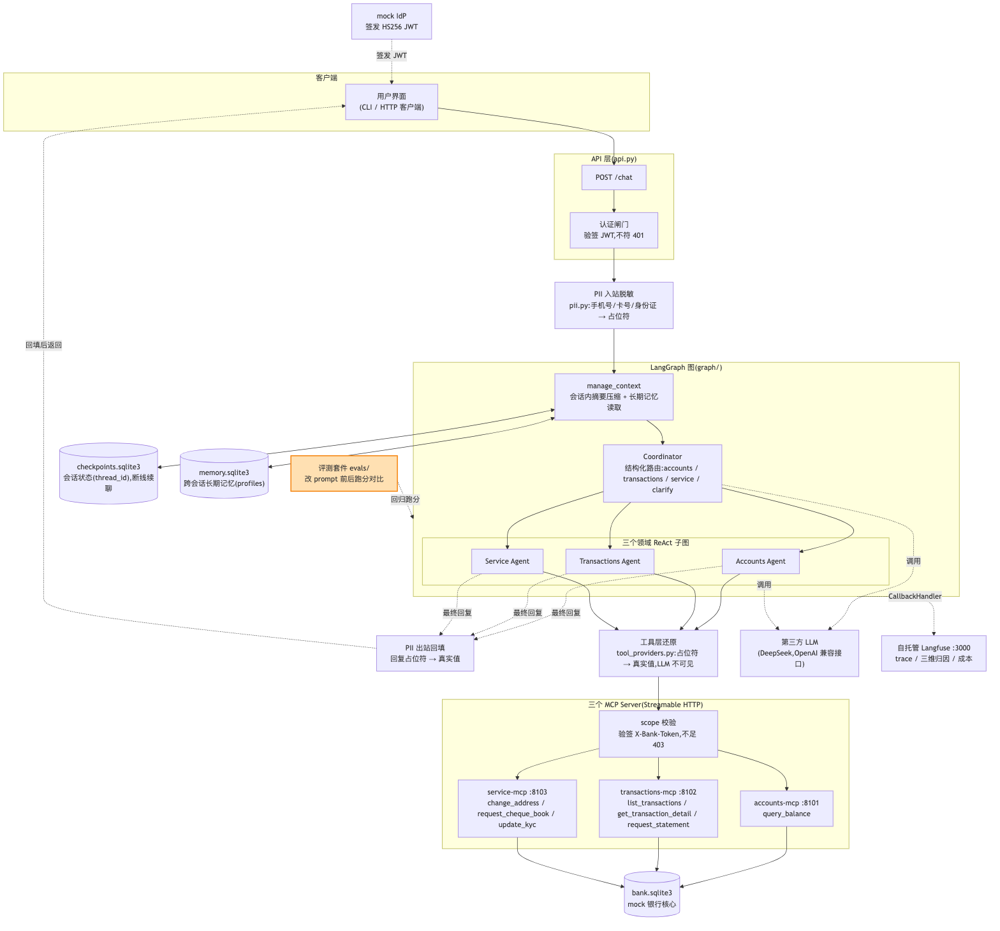
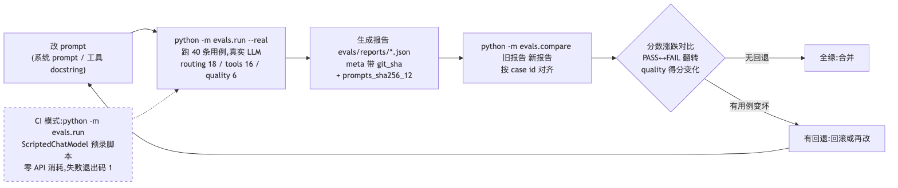

# E8 评测套件:改 prompt 前后的跑分对比

> 对应 git tag:`e8`(与 e7 同 commit,评测套件在此就绪)
> 本集痛点:改一行 prompt 等于改一行"隐性代码",没有回归保障,你敢改吗。
> 上一集:E7 可观测性与成本 | 下一集:E9 Edge 收尾与接真银行系统

## 开场话术

做传统软件的时候,我们改一行代码,第一反应是什么?
跑回归测试。
绿灯亮了才敢合并,红灯亮了就知道碰坏了什么,这是软件工程几十年练出来的肌肉记忆。
没有回归测试的老项目,大家管他叫"祖传代码",动一处塌三处,没人敢碰。
可到了大模型系统,画风突变:整个团队围着一句 prompt 反复斟酌,改完以后怎么验收?
把系统拉起来,人肉聊三句,"感觉还行",上线。
运气好,聊的三句恰好覆盖了出问题的场景;运气不好,客户替你发现。
问题是一行 prompt 就是一行"隐性代码",它的行为影响面比一行普通代码大得多。
它同时影响路由往哪走、工具选哪个、话怎么说,而我们对它的回归保障是零。
于是行业里出现一个心照不宣的现象:prompt 没人敢动。
路由不准了,不敢改;话术太啰嗦,不敢改;换个模型,更不敢改。
因为没人说得清改完之后,其他地方会不会塌,塌在哪。
不敢改 prompt,翻译过来就是不敢维护系统。
一套不敢维护的系统,从上线第一天起就在等死。
上一集我们让系统"看得见",出了问题能在 trace 里找到现场。
这一集让它"量得出":四十条评测用例,一个命令出跑分,改 prompt 前后各跑一次,变化逐条列给你看。
等会儿我会当着镜头删掉 Coordinator 指令里的一行,然后让数据自己说话。
看完这一集,"你敢改吗"这个问题,应该有一个有底气的答案。


图注:运行时架构照旧,新增的是右下角的评测套件 evals/;它不进请求链路,而是从外部驱动整套系统跑分,相当于给系统配了一台体外体检机。

## 概念要点

- **评测数据集就是回归测试集**:`evals/datasets/` 下三个文件,routing.jsonl 十八条、tools.jsonl 十六条、quality.jsonl 六条,共约四十条。
  三个文件对应三个验收层面:路由对不对、工具调得对不对、话说得好不好。
  写新用例的成本就是往 jsonl 里追加一行,门槛低到没有理由不写。
- **一条用例长什么样**:每行一个 JSON,带 id、kind、input,再加 expect(确定性期望)或 rubric(评审标准),有的还带 script(脚本化重放)。
  等会儿镜头打开 routing.jsonl 第一条,观众一眼就能看懂结构,没有任何黑魔法。
- **评测设计第一原则:能确定的绝不交给模型判断**。
  路由目标、工具名与参数、回复里有没有关键金额、写操作有没有落库,这些全部用确定性断言,对就是对、错就是错。
  只有话术质量这种没法写死规则的,才交给 LLM-as-judge,按 rubric 打分(`evals/judges.py`)。
  原因很简单:模型判断有波动,而回归门禁需要的是稳定信号。
- **两档运行模式**(`evals/run.py`):默认 CI 模式只跑带 script 的确定性用例,用 ScriptedChatModel 假模型(`src/bank_agent/testing/fake_model.py`)按剧本重放,零 API 消耗、秒级跑完。
  `--real` 才跑全量约四十条,真实模型加评审模型,消耗额度,只由人手动触发。
  有失败用例时进程退出码为 1,这条是给 CI 门禁留的接口。
- **报告可精确归因**(`evals/report.py`):每轮产出 `evals/reports/<时间戳>-<git短sha>.json` 和同名 .md,多次运行互不覆盖。
  元信息里带 git 提交哈希和 prompts.py 的内容哈希——改 prompt 前后的两份报告,一眼能确认"跑的不是同一份 prompt"。
- **对比器把变化逐条列出**(`evals/compare.py`):`python -m evals.compare <旧.json> <新.json>`。
  哪些用例从通过变失败、哪些修好了、评审分数涨跌多少,一目了然。
  它回答的正是那个灵魂问题:这次改动让谁变好、让谁变坏。
  注意它的输入是两份报告文件,不是两次现场运行——评测结论因此可以存档、可以贴进评审记录。


图注:改 prompt、跑全量、出报告、compare 对比,无回退才合并、有回退就回滚再改;虚线是零消耗的 CI 模式,日常把它当单测跑。

## 演示步骤

1. 检出本集 tag:
   ```bash
   git checkout e8
   ```
   预期:工作区切到评测套件就绪的版本。
2. 先给观众看数据集长什么样:
   ```bash
   head -1 evals/datasets/routing.jsonl
   ```
   预期:打印出 `r-acc-01` 那条——输入"帮我查一下余额",期望路由到 accounts,后面还带一段 script,可以在 CI 模式下用假模型确定性重放。
   (镜头:指着这一行说,"这就是我们系统的回归测试用例,跟传统单测一个地位,只是测试对象从函数换成了 Agent")
3. 零成本自检,先跑 CI 模式:
   ```bash
   python -m evals.run
   ```
   预期:只跑带 script 的确定性用例,假模型按剧本重放,秒级完成,全部通过,退出码 0,并打印报告路径。
   (讲解:日常开发跑这个就够,不花一分钱 API 额度;CI 流水线里的 pytest 全量也是确定性假模型,包含这套评测的 CI 子集)
4. 建立基线,全量真跑:
   ```bash
   python -m evals.run --real
   ```
   预期:约四十条用例走真实 LLM,quality 用例由评审模型按 rubric 打分,跑完打印通过数与报告路径,记下这份基线 JSON 的路径。
   (口播提示:这一步消耗真实额度,所以只有人手动触发,CI 绝不跑它;这也是本集唯一花钱的环节,而且只花两次)
5. 现场制造回归。
   打开 `src/bank_agent/prompts.py`,找到 COORDINATOR_PROMPT 里那一行:
   `- clarify:意图不明,需要反问用户;此时 question 填一句中文反问`
   整行删掉,保存。
   (讲解:这相当于有人"优化"prompt 时顺手删了一句指令,看上去无关紧要——传统软件里这就是一次普通提交,而这里是改隐性代码,影响面肉眼看不见)
6. 再跑一次全量:
   ```bash
   python -m evals.run --real
   ```
   预期:通过率下降,若干 clarify 相关用例失败,失败列表直接打在终端上,退出码为 1,生成第二份报告。
   (镜头:先指着退出码说一句,"在真实流水线里,这一下红灯就亮了,合并被拦在门外")
7. 对比两份报告:
   ```bash
   python -m evals.compare <基线.json> <新.json>
   ```
   预期:开头两行打出两份报告的元信息,随后哪些用例从 PASS 翻成 FAIL 逐条列出,routing 通过率下降,被删掉的 clarify 指令对应的用例赫然在列。
   (重点镜头:观众亲眼看到"删一行 prompt"和"哪些客户场景塌了"之间的因果关系,这是本集的高光时刻)
8. 指着 compare 输出的元信息行讲 prompts 哈希:
   两份报告的 `prompts_sha256_12` 不一样,git 提交号却是一样。
   这证明代码一行没动、动的是 prompt,两次跑的不是同一份"隐性代码",归因无争议。
   (讲解:没有这个哈希,评审会永远吵"你是不是还改了别的";有了它,prompt 变更和代码变更一样有据可查)
9. 恢复现场并确认:
   ```bash
   git checkout -- src/bank_agent/prompts.py
   ```
   预期:prompt 复原;口播说明此时重跑一次 `--real` 应回到基线水平。
   为省额度,镜头前恢复文件即可,强调"改回即恢复"这一点——评测体系让"改回去"也有证据,而不是靠记忆。
10. 补一段成本纪律:CI 模式零消耗,日常随便跑,把它当单测用。
    `--real` 消耗真实额度,只在改了 prompt、路由逻辑或换了模型之后,由人手动跑一次。
    还可以用 `--kinds routing,tool` 只跑关心的类别,把花在刀刃上的钱再砍一刀。
11. 给观众留作业:clone 仓库后第一件事,跑 `python -m evals.run`(CI 模式)和 `make test`,零成本看到全绿,再开始动代码做实验。
    先有了安全网,再谈折腾,顺序不要反。
12. 演示结束:
    ```bash
    git checkout main
    ```

## 收尾钩子

今天这套东西说穿了就一句话:把大模型系统里最虚的那部分——prompt 的行为——变成了一份可重放、可对比、可设门禁的跑分。
从这一集开始,"你敢改吗"不再是胆量问题,而是一条命令的事。
维护一个 LLM 系统,第一次有了和维护传统软件一样的工程尊严。
回头看我们的验收清单:能聊、安全、记得住、可观测、可度量,一格一格勾到了现在。
那是不是可以上线了?
还差最后一道坎:这个服务此刻只躺在你本机,公网入口前面的 WAF、限流、DDoS 防护还没着落,而且这些事压根不该写在应用代码里。
以及全系列最初那个问题,该给最终答案了:这套系统真要接进一家银行,到底该替换哪几个模块、保留哪几层?
下一集,收官。
