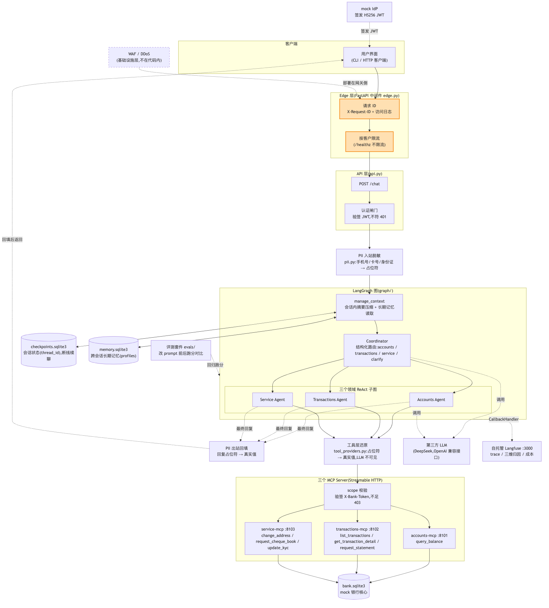

# E9 Edge 收尾与接真银行系统(收官)

> 对应 git tag:`e9`(main 最新;Edge 栈在 fb5498c 已就绪,本集全程在 main 演示)
> 本集痛点:内网跑通的系统和敢暴露到公网的系统之间,隔着整个 Edge 层。
> 上一集:E8 评测套件 | 下一集:无,全系列收官

## 开场话术

九集下来,我们的银行 AI 客服在内网里已经很体面了。
能路由、能授权、能记住人、会脱敏、有 trace、有评测分数。
但请你把它从 localhost 挪到公网域名下,老板问一句"现在敢开给客户用吗",会议室会突然安静。
因为内网跑通和敢暴露到公网之间,隔着的不是一个功能,是整个 Edge 层。
公网上有脚本小子拿你的接口当靶子刷,有攻击流量想把你打挂,有监管问你要每一次访问的完整留痕。
这些东西在 demo 视频里永远不会出现,但它们决定了你的系统是"作品"还是"产品"。
更扎心的是,这一层的及格线没有中间态:客户不会因为你的 Agent 很聪明,就原谅一次越权查询或者一次被打挂的服务。
还有一件事,我猜很多观众从第一集憋到了现在:这套系统背后是 mock 银行核心,那它到底是不是个玩具?
毕竟再漂亮的架构,如果离了 mock 就要推倒重来,那它和玩具没有区别。
今天我把这个问题正面回答掉:接真实银行系统,到底要换掉什么,留下什么。
答案会比你想的短得多,而这个"短",恰恰是我们九集架构的价值证明。
今天的三件事:先把 Edge 层的最后几块砖砌上——请求 ID、访问日志、限流;然后讲透一个反直觉的论点——WAF 和 DDoS 防护为什么坚决不写进代码;最后对着上线清单和替换模块表,给全系列画上句号。


图注:这是十集走到的终点,客户端与 API 之间补上了 Edge 层,请求 ID、访问日志、按客户限流归代码管,WAF 与 DDoS 留在基础设施层;一张图看清谁在门内、谁在门外。

## 概念要点

- **请求 ID 与访问日志**:每个请求进门就发一个 request ID,响应头 `X-Request-ID` 带回给调用方,访问日志(logger `bank_agent.access`)记录 request ID、方法、路径、状态码、耗时、客户,一次调用全链路按这一个 ID 串联(`src/bank_agent/edge.py`,`RequestContextMiddleware`)。
  一句话:客户报障只说"用不了",你靠这一串 ID 在日志里捞出他那次请求的完整一生。
- **按客户限流**:`/chat` 端点用 `@limiter.limit` 声明限速,默认每客户每分钟 60 次(`RATE_LIMIT_PER_MINUTE`,见 `src/bank_agent/config.py` 与 `.env.example`)。
- **限流分桶键的小心机**:分桶键从 Bearer token 里**不验签**解出 `sub`,只用于计数分桶;鉴权仍由 api 层 `verify_token` 严格执行(`src/bank_agent/edge.py` 的 `rate_limit_key`,对比 `src/bank_agent/api.py` 的 `require_auth`)。
  一句话:限流是门卫掐秒表,验票还是验票员的事,两件事不混。
- **超限的体面**:超限返回 429 和一句人话 `请求过于频繁,请稍后再试`(`src/bank_agent/edge.py` 的 `_rate_limit_exceeded_handler`)。
- **健康检查不限流**:`/healthz` 给负载均衡和监控系统探活,不参与限流(`src/bank_agent/api.py`)。
- **中间件是最外层兜底**:`RequestContextMiddleware` 挂在最外层,正常响应与异常响应都有 request ID 和访问日志,不存在"出错了就没留痕"(`src/bank_agent/edge.py`)。
- **WAF 与 DDoS 在基础设施层**:攻击流量必须在到达你的进程之前被拦下,应用层该做的——认证、授权、限流、请求 ID、访问日志——我们全做了,其余交给网关与云厂商(`docs/go-live.md`)。
- **上线清单与替换模块表**:距离上线还差什么、接真银行系统换哪几层,全部写在 `docs/go-live.md`,本集逐节走读。

## 演示步骤

1. 确认在 main(本集不需要 checkout 旧 tag),起栈:
   ```bash
   make run    # 种子数据 + Langfuse + 3 个 MCP Server + API
   ```
   预期:API 起在 8000 端口,三个 MCP Server 与 Langfuse(有 docker 时)一并拉起。
2. 另一个终端取 token:
   ```bash
   TOKEN=$(python -m bank_agent.auth.idp C001)
   ```
   预期:拿到张三的 JWT,环境变量就绪。
3. 带 token 调一次 `/chat`,`-i` 把响应头打出来:
   ```bash
   curl -i -X POST http://localhost:8000/chat \
     -H "Authorization: Bearer $TOKEN" \
     -H "Content-Type: application/json" \
     -d '{"message":"帮我查查余额"}'
   ```
   预期:正常回答余额;响应头里有一行 `X-Request-ID: <12 位十六进制>`。
   (镜头:把这串 ID 圈出来——"公网上客户报障,你问他要的就是这一串。")
   若观众问为什么演示要消耗一次真实 LLM 调用:因为限流和日志必须在真实请求路径上看,mock 出来的流量骗不过中间件。
4. 切回 API 终端看访问日志。
   预期:`bank_agent.access` 打出一行,格式为 `请求ID POST /chat -> 200 耗时ms customer=C001`,request ID 与上一步响应头一致。
   (讲解:这一行日志在 E7 的 Langfuse trace 之外,是 HTTP 层的留痕,两者靠 request ID 对得上。)
5. 停掉服务,临时把限流压到每分钟 5 次重启:
   ```bash
   RATE_LIMIT_PER_MINUTE=5 make run
   ```
   预期:服务正常拉起,限流桶变小。
6. 连刷 8 次 `/chat`,只看状态码:
   ```bash
   for i in $(seq 1 8); do
     curl -s -o /dev/null -w "%{http_code}\n" -X POST http://localhost:8000/chat \
       -H "Authorization: Bearer $TOKEN" \
       -H "Content-Type: application/json" \
       -d '{"message":"查余额"}'
   done
   ```
   预期:前 5 次是 200(或业务正常码),第 6 次起变成 429。
   (镜头:指着状态码从 200 翻到 429 那一行——"单用户刷后端,被门卫掐停。")
7. 趁限流还没恢复,连刷 `/healthz`:
   ```bash
   for i in $(seq 1 10); do curl -s http://localhost:8000/healthz; echo; done
   ```
   预期:10 次全部返回 `{"status":"ok"}`,一次 429 都没有。
   (讲解:探活流量不该被限流误伤,这是 Edge 层的基本教养。)
   顺手再发一次 `/chat`,观察状态码是否仍是 429,确认限流桶按客户维度独立计数、没有被健康检查消耗。
8. 停掉演示实例,恢复正常阈值重启或直接收尾。
9. 走读上线清单之前,先让 CHANGEME 自己说话:
   ```bash
   grep -n "CHANGEME" docker-compose.yml
   ```
   预期:DATABASE_URL、SALT、ENCRYPTION_KEY、CLICKHOUSE_PASSWORD 等占位密钥逐行列出。
   (镜头:"这些占位符能帮你跑起 demo,也能让你在公网第一天就翻车——上线前全部替换。")
10. 打开 `docs/go-live.md`,逐节走读上线清单,讲解口径如下(不跑命令):
    - 认证:mock IdP 换真实 IdP(OIDC),`auth/tokens.py` 验签改为校验 IdP 公钥(JWKS),本地密钥退役;
    - Edge:限流阈值按容量评估,限流状态从进程内内存外置到 Redis,否则多实例各算各的账;
    - 数据:SQLite 换生产库,`core/db.py` 改连接串,checkpointer 与 store 换 `langgraph-checkpoint-postgres`,种子脚本仅用于演示;
    - 可观测:Langfuse 换高可用部署,价格表随实例迁移;
    - 回归:每次改 prompt 或路由逻辑,跑 `python -m evals.run --real` 并与基线报告对比(E8 的家底在这里派上用场);
    - 运营:降级话术与客服运营口径确认——技术上线之前,人先对齐。

## 收尾钩子

收官这一段,先把 WAF 与 DDoS 为什么在基础设施层讲透,这是今天最硬的一个论点。
第一,网络位置:攻击流量应该在到达你的进程之前就被拦下,流量进了你的应用进程再挡已经晚了,带宽和连接表早被打爆。
第二,规模不对等:DDoS 是带宽与状态表的消耗战,单机应用代码无能为力,只有上游的 scrubbing、Anycast、网关扛得住。
第三,规则库是运营职能:WAF 规则和威胁情报天天在更新,云 WAF 由专业团队运营,写进业务代码等于把防线冻结在你的发版节奏里。
第四,代码里"假装实现"是最差选项:一个玩具 WAF 给人虚假安全感,还可能误拦正常客户。
第五,应用层该做的我们一件没落下:认证、授权、限流、请求 ID、访问日志——这才是代码的安全边界。
然后是观众憋了九集的问题:接真银行系统,换掉什么。
照 `docs/go-live.md` 的表,只有三层。
第一层,仓储:`core/repositories.py` 加 `db.py` 加 `models.py`,从 SQLModel 加 SQLite 换成调用真实银行核心 API 的客户端,函数签名和返回结构原样保留,领域工具、MCP Server、Agent 全部不变。
第二层,认证:`auth/idp.py` 加 `tokens.py`,本地密钥 JWT 换成真实 IdP 的 OIDC 与 JWKS 验签,scope 校验和 config 通道传 token 的机制不变。
第三层,三个 MCP Server:契约不动、schema 不动、scope 声明不动,只换它们背后的仓储实现。
除此之外呢?没有了。
Agent、图、PII、记忆、Edge,零改动。
所以 mock 不是玩具,是按可替换的形状建造的脚手架——脚手架的形状对了,楼才能往上盖。
现在复盘整条叙事链。
E1 我们让一个挂满工具的天真 Agent 现场翻车,制造了问题。
E2 垂直拆分,一个调度员加三个领域专员,但拆出了协调问题。
E3 解决身份:token 走 config 通道,LLM 永远碰不到凭证。
E4 解决状态:断线续聊,共享状态有了写者与 reducer 规则。
E5 解决记忆:会话内摘要压缩,跨会话长期偏好。
E6 解决数据安全:手机号和卡号不再原样发给第三方 LLM。
E7 解决可观测:trace 里现场抓出一次路由错误。
E8 解决可度量:改 prompt 前后跑分对比,"你敢改吗"从此有实证。
E9 解决可上线:Edge 收尾、上线清单、替换路径,全系列收官。
回头看,这条链的顺序不能乱:没有 E1 的翻车,E2 的拆分就没有动机;没有 E3 到 E6 的安全底座,E7、E8 的可观测与可度量就是在给危房装仪表。
九集没有一个决策是为了炫技,每一步都是上一步的代价逼出来的。
这套系统今天仍然是个学习项目,但它的每一层接缝都开在正确的位置上——这,就是工业级和玩具的分界线。
如果你只追了其中几集,我的建议是回到 E1,把九个 tag 逐个 checkout 一遍,亲手让系统翻车一次、再亲手把它修好一次。
看懂的架构是别人的,拆过又装回去的架构才是你的。
银行不会因为我们拍了一个教学系列就改变它对系统的验收标准,所以最后一句话送给准备动手的你:先把接缝开对,再谈智能。
感谢陪我们到最后的每一位观众,下课。
